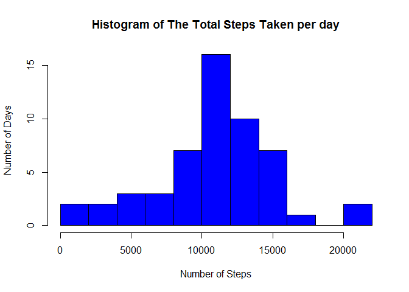
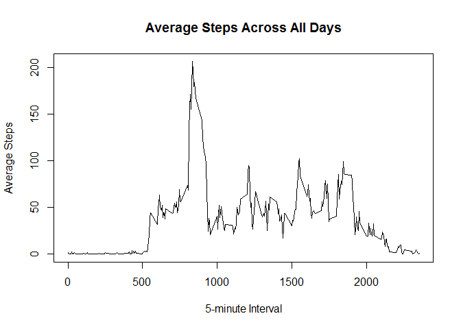
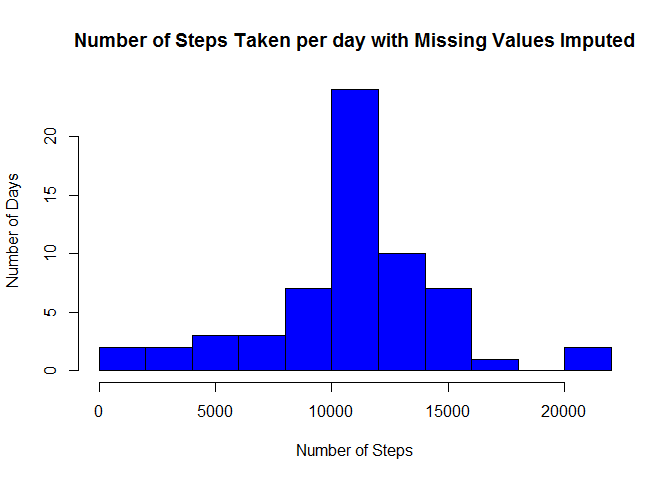
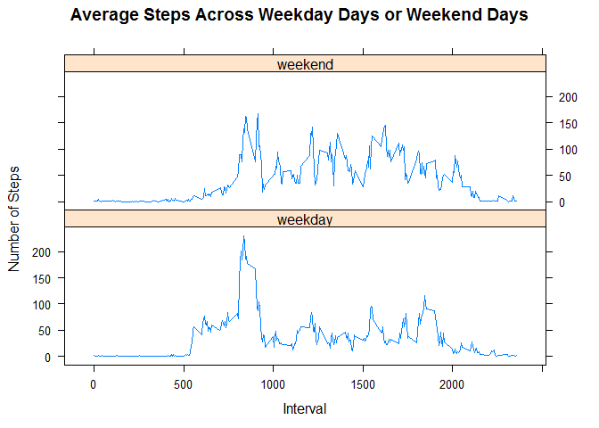

# Reproducible Research: Peer Assessment 1
Tai Chin Chuen  
January 22, 2017  

## Loading and preprocessing the data

### 1. Load the data (i.e. read.csv()).


```r
activitydata <- read.csv("activity.csv")
head(activitydata)
```

```
##   steps       date interval
## 1    NA 2012-10-01        0
## 2    NA 2012-10-01        5
## 3    NA 2012-10-01       10
## 4    NA 2012-10-01       15
## 5    NA 2012-10-01       20
## 6    NA 2012-10-01       25
```

```r
str(activitydata)
```

```
## 'data.frame':	17568 obs. of  3 variables:
##  $ steps   : int  NA NA NA NA NA NA NA NA NA NA ...
##  $ date    : Factor w/ 61 levels "2012-10-01","2012-10-02",..: 1 1 1 1 1 1 1 1 1 1 ...
##  $ interval: int  0 5 10 15 20 25 30 35 40 45 ...
```

### 2. Process/transform the data (if necessary) into a format suitable for your analysis.


```r
activitydata$date <- as.Date(activitydata$date, "%Y-%m-%d")
str(activitydata)
```

```
## 'data.frame':	17568 obs. of  3 variables:
##  $ steps   : int  NA NA NA NA NA NA NA NA NA NA ...
##  $ date    : Date, format: "2012-10-01" "2012-10-01" ...
##  $ interval: int  0 5 10 15 20 25 30 35 40 45 ...
```

```r
summary(activitydata)
```

```
##      steps             date               interval     
##  Min.   :  0.00   Min.   :2012-10-01   Min.   :   0.0  
##  1st Qu.:  0.00   1st Qu.:2012-10-16   1st Qu.: 588.8  
##  Median :  0.00   Median :2012-10-31   Median :1177.5  
##  Mean   : 37.38   Mean   :2012-10-31   Mean   :1177.5  
##  3rd Qu.: 12.00   3rd Qu.:2012-11-15   3rd Qu.:1766.2  
##  Max.   :806.00   Max.   :2012-11-30   Max.   :2355.0  
##  NA's   :2304
```

## What is mean total number of steps taken per day?

### 1. Calculate the total number of steps taken per day.
For this part of the assignment, the missing values in the dataset can be ignored.

```r
totalsteps <- aggregate(steps ~ date, data = activitydata, sum, na.rm = TRUE)
head(totalsteps)
```

```
##         date steps
## 1 2012-10-02   126
## 2 2012-10-03 11352
## 3 2012-10-04 12116
## 4 2012-10-05 13294
## 5 2012-10-06 15420
## 6 2012-10-07 11015
```

### 2. If you do not understand the difference between a histogram and a barplot, research the difference between them. Make a histogram of the total number of steps taken each day.


```r
hist(totalsteps$steps, main = "Histogram of The Total Steps Taken per day", xlab = "Number of Steps", ylab="Number of Days", breaks = 10, col = "blue")
```

<!-- -->

### 3. Calculate and report the mean and median of the total number of steps taken per day.


```r
mean(totalsteps$steps)
```

```
## [1] 10766.19
```

```r
median(totalsteps$steps)
```

```
## [1] 10765
```

## What is the average daily activity pattern?

### 1. Make a time series plot (i.e. type = "l") of the 5-minute interval (x-axis) and the average number of steps taken, averaged across all days (y-axis).


```r
averagesteps <- aggregate(steps~interval, activitydata, mean)
with(averagesteps, plot(interval, steps, type = "l", xlab = "5-minute Interval", ylab = "Average Steps", main = "Average Steps Across All Days"))
```

<!-- -->

### 2. Which 5-minute interval, on average across all the days in the dataset, contains the maximum number of steps?


```r
maxaveragesteps <- averagesteps[which.max(averagesteps$steps), 1]
```

The 5-minute interval that contains the maximum number of steps is 835.

## Imputing missing values

### 1. Calculate and report the total number of missing values in the dataset (i.e. the total number of rows with NAs).


```r
missingdata <- is.na(activitydata[ , 1])  
table(missingdata)
```

```
## missingdata
## FALSE  TRUE 
## 15264  2304
```

```r
nummissingdata <- sum(missingdata)
nummissingdata
```

```
## [1] 2304
```

The total number of missing values in the dataset is 2304.

### 2. Devise a strategy for filling in all of the missing values in the dataset. The strategy does not need to be sophisticated. For example, you could use the mean/median for that day, or the mean for that 5-minute interval, etc.

The mean for that 5-minute interval will be adopted for filling in all of the missing values in the dataset.

```r
averagesteps <- aggregate(steps~interval, activitydata, mean)
```

### 3. Create a new dataset that is equal to the original dataset but with the missing data filled in.


```r
newdata <- activitydata

for (i in 1:nrow(newdata)) {
  if (is.na(newdata$steps[i])) {
    newdata$steps[i] <- averagesteps[which(newdata$interval[i] == averagesteps$interval), ]$steps
  }
}
```

Check if there is any missing value in the dataset.

```r
sum(is.na(newdata))
```

```
## [1] 0
```

### 4. Make a histogram of the total number of steps taken each day and Calculate and report the mean and median total number of steps taken per day. Do these values differ from the estimates from the first part of the assignment? What is the impact of imputing missing data on the estimates of the total daily number of steps?


```r
newtotalsteps <- aggregate(steps ~ date, data = newdata, sum, na.rm = TRUE)
head(newtotalsteps)
```

```
##         date    steps
## 1 2012-10-01 10766.19
## 2 2012-10-02   126.00
## 3 2012-10-03 11352.00
## 4 2012-10-04 12116.00
## 5 2012-10-05 13294.00
## 6 2012-10-06 15420.00
```

```r
hist(newtotalsteps$steps, xlab="Number of Steps", ylab="Number of Days", main="Number of Steps Taken per day with Missing Values Imputed", breaks = 10, col = "blue")
```

<!-- -->

```r
mean(newtotalsteps$steps)
```

```
## [1] 10766.19
```

```r
median(newtotalsteps$steps)
```

```
## [1] 10766.19
```

The median differs from the estimates in the first part of the assignment.
The new median is slightly higher than the previous estimates, however the new mean remains the same as the estimates in the first part of the assignment.

## Are there differences in activity patterns between weekdays and weekends?

### 1. Create a new factor variable in the dataset with two levels - "weekday" and "weekend" indicating whether a given date is a weekday or weekend day.


```r
class(newdata$date)
```

```
## [1] "Date"
```

```r
weekdata <- ifelse(weekdays(newdata$date) %in% c("Saturday", "Sunday"), "weekend", "weekday")
newdata$weekdata <- as.factor(weekdata)
str(newdata)
```

```
## 'data.frame':	17568 obs. of  4 variables:
##  $ steps   : num  1.717 0.3396 0.1321 0.1509 0.0755 ...
##  $ date    : Date, format: "2012-10-01" "2012-10-01" ...
##  $ interval: int  0 5 10 15 20 25 30 35 40 45 ...
##  $ weekdata: Factor w/ 2 levels "weekday","weekend": 1 1 1 1 1 1 1 1 1 1 ...
```

```r
head(newdata)
```

```
##       steps       date interval weekdata
## 1 1.7169811 2012-10-01        0  weekday
## 2 0.3396226 2012-10-01        5  weekday
## 3 0.1320755 2012-10-01       10  weekday
## 4 0.1509434 2012-10-01       15  weekday
## 5 0.0754717 2012-10-01       20  weekday
## 6 2.0943396 2012-10-01       25  weekday
```

### 2. Make a panel plot containing a time series plot (i.e. type = "l") of the 5-minute interval (x-axis) and the average number of steps taken, averaged across all weekday days or weekend days (y-axis). See the README file in the GitHub repository to see an example of what this plot should look like using simulated data.


```r
newaveragesteps <- aggregate(steps~interval+weekdata, newdata, mean)

library(lattice)
xyplot(steps ~ interval | weekdata,
       layout = c(1, 2),
       xlab = "Interval",
       ylab = "Number of Steps",
       main = "Average Steps Across Weekday Days or Weekend Days",
       type = "l",
       data = newaveragesteps)
```

<!-- -->
